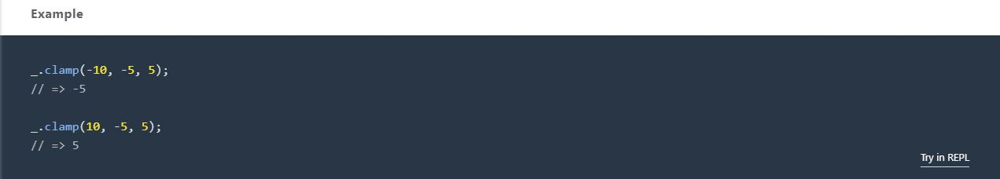
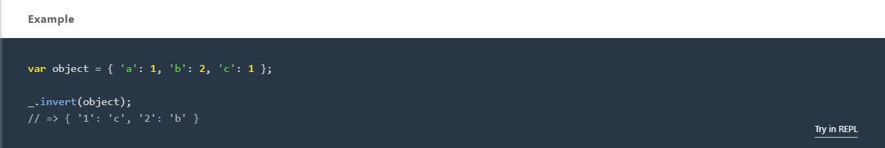

# Re-creating the Lodash Library

Re-creating the Lodash Library is an open-ended project that is part of Codecademy's Web Development career path. The requirements were to implement some of the functionality from the widely-popular lodash.js library, which provides many methods that add new functionality for numbers, strings, objects, and arrays.
Ten methods were selected for us to implement on our own as an invaluable exercise in problem-solving. We followed the following steps below to re-create each method:

1. Specify the functionality of the method we are implementing
2. Ideate a game plan for how to implement this functionality in code
3. Implement our game plan
4. Test our code to ensure it works as expected

We completed the “Ideate” and “Implement” steps on our own to develop a solution before comparing our code to Codecademy's suggested solution for each method.

## Table of Contents

- [Technologies](#technologies)
- [Screenshots](#screenshots)
- [Status](#status)

## Technologies

This project was created with:

- JavaScript ES6

## Screenshots

### [Lodash .clamp Method](https://lodash.com/docs/4.17.15#clamp)

### My .clamp Method Solution Code

### [Lodash .inRange Method](https://lodash.com/docs/4.17.15#inRange)

### My .inRange Method Solution Code

### [Lodash .invert Method](https://lodash.com/docs/4.17.15#invert)

### My .invert Method Solution Code

### [Lodash .dropWhile Method](https://lodash.com/docs/4.17.15#dropWhile)

### My .dropWhile Method Solution Code

### [Lodash .chunk Method](https://lodash.com/docs/4.17.15#chunk)

### My .chunk Method Solution Code

## Status

This project has been completed.
